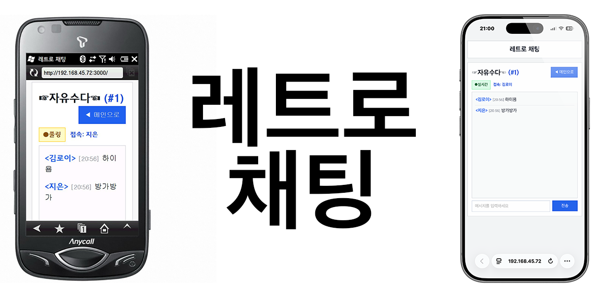

# 레트로 채팅

구형 브라우저(예: Windows Mobile 6.0 Opera)에서는 Ajax 폴링으로, 최신 브라우저에서는 WebSocket으로 동작하는 채팅 앱입니다.

## ✨ 기능
- 로그인/회원가입
- 아이디 규칙: 한글/영문/숫자만 허용 (`^[A-Za-z0-9가-힣]+$`)
- 비밀번호 암호화 저장(PBKDF2-SHA512 + salt)
- 채팅방 생성
- 채팅방 입장/메시지 전송
- 연결 상태 표기
  - `실시간(WebSocket) 모드`
  - `Ajax 폴링 모드`

## 🚀 실행
1. Node.js 18+ 설치
2. 의존성 설치

```bash
npm install
```

3. 서버 실행

```bash
npm start
```

4. 브라우저 접속

- `http://localhost:3000`

## 📂 데이터 구조
- `server.js`: API, DB(SQLite), 인증, WebSocket
- `public/index.html`: UI
- `public/app.js`: 클라이언트 로직(Ajax 폴링 + WebSocket)
- `public/style.css`: 스타일